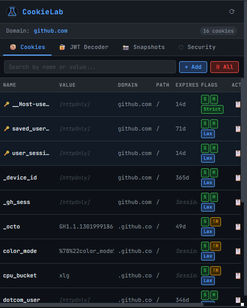

<div align="center">

# CookieLab

> Developer-focused cookie manager for security learning and backend testing.




</div>

---

## ⚠️ Disclaimer

> **CookieLab is intended for educational and development use only.**
> Use it solely on systems you own or have explicit permission to test. Unauthorized access to third-party systems is illegal.

---

## Features

| Feature | Description |
|---|---|
| **Cookie Manager** | View, add, edit, delete, search, and toggle cookies with full metadata |
| **JWT Decoder** | Auto-detect and decode JWT tokens — header, payload, signature + `exp` countdown |
| **Snapshots** | Save and restore cookie states; export/import as JSON |
| **Security Analyzer** | Flag missing `Secure`, `HttpOnly`, `SameSite` issues with severity levels |
| **Session Highlight** | Auto-detect sensitive cookies (`session`, `token`, `auth`, `jwt`, `sid`…) |
| **Cookie Toggle** | Disable/enable cookies without deleting them |

---

## Installation

> No build step required — pure HTML/CSS/JS.

1. Clone or download this repository
2. Open Chrome → `chrome://extensions`
3. Enable **Developer mode** (top-right toggle)
4. Click **Load unpacked** → select the `cookielab/` folder
5. Click the CookieLab icon in the toolbar on any page

---

## Usage

Navigate to any website, open CookieLab, and use the four tabs:

| Tab | What you can do |
|-----|----------------|
| Cookies | View, search, add, inline-edit, copy, toggle, delete cookies |
| JWT | Decode any JWT — paste manually or send directly from a cookie row |
| Snapshots | Save/restore login states; export/import as JSON |
| Security | Per-cookie analysis with critical / warning / clean indicators |

---

## File Structure

```
cookielab/
├── manifest.json               # MV3 manifest, permissions
├── popup/
│   ├── popup.html              # 4-tab UI
│   ├── popup.css               # Dark theme (JetBrains Mono)
│   └── popup.js                # All extension logic
├── background/
│   └── service_worker.js       # MV3 service worker
└── icons/
    └── icon.svg                # Extension icon
```

---

## Tech Stack

- **Chrome Extensions API** — `chrome.cookies`, `chrome.storage`, `chrome.tabs`
- **Manifest V3** — Service worker background, declarative permissions
- **Vanilla JavaScript** — No frameworks or dependencies
- **CSS Custom Properties** — Dark theme with JetBrains Mono font

---

## Permissions

| Permission | Why it's needed |
|------------|----------------|
| `cookies` | Read, write, and delete cookies |
| `activeTab` | Get the URL of the current tab |
| `tabs` | Query the active tab's URL |
| `storage` | Save snapshots locally |
| `<all_urls>` | Access cookies across all domains |

---

<div align="center">

**MIT License © 2026 Adil NAS**

[](https://github.com/Adilnasceng)
[](https://github.com/sponsors/Adilnasceng)

</div>
